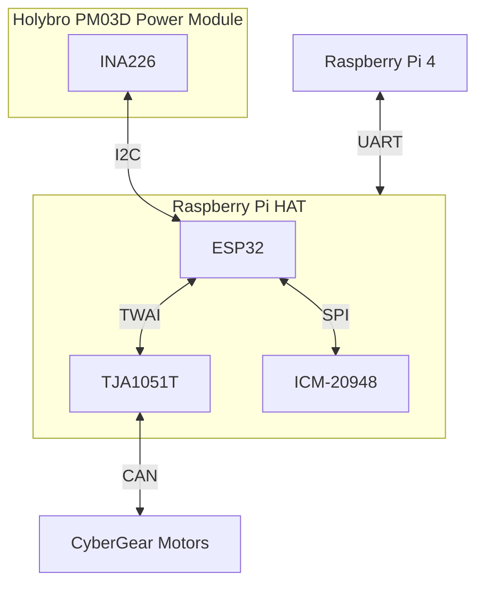

# CyberBot

CyberBot is a two-wheeled balancing robot based on a five-bar linkage. Its hardware is built around a Raspberry Pi 4 and a custom HAT. The HAT hosts an ESP32-S3 that handles the low-level balancing task. It communicates with the ICM-20948 IMU and six Xiaomi CyberGear motors.

The Holybro PM03D power module distributes power to the system. The ESP32 runs a micro-ROS node that communicates over a serial connection with ROS 2 on the Raspberry Pi.

A Gazebo simulation is available, but remains a work in progress. The project is not yet complete; additional repositories will be published and documented over time.

## Repositories

### Raspberry Pi and ROS2

| Repository                                                                     | Description                                                           |
| ------------------------------------------------------------------------------ | --------------------------------------------------------------------- |
| [yocto-cyberbot](https://github.com/cybergear-robotics/yocto-cyberbot)         | Yocto project for the Raspberry Pi on the CyberBot platform.          |
| [meta-cyberbot](https://github.com/cybergear-robotics/meta-cyberbot)           | Yocto layer with CyberBot-specific customizations.                    |
| [ros2-cyberbot](https://github.com/cybergear-robotics/ros2-cyberbot)           | ROS 2 package with `ros2_control` and Gazebo support for CyberBot.    |
| [mcu_msgs](https://github.com/cybergear-robotics/mcu_msgs)                     | Messages between the micro-ROS node on the microcontroller and ROS 2. |
| [meta-microros](https://github.com/cybergear-robotics/meta-microros)           | Yocto layer for the micro-ROS agent.                                  |
| [esp_rfc2217_server](https://github.com/cybergear-robotics/esp_rfc2217_server) | RFC 2217 server for ESP32 and Raspberry Pi.                           |
| [meta-ros](https://github.com/cybergear-robotics/meta-ros)                     | OpenEmbedded layers for ROS 1 and ROS 2.                              |

### Microcontroller Firmware and Components

| Repository                                                   | Description                                                   |
| ------------------------------------------------------------ | ------------------------------------------------------------- |
| [cybergear](https://github.com/cybergear-robotics/cybergear) | ESP-IDF library for Xiaomi CyberGear motors.                  |
| [icm20948](https://github.com/cybergear-robotics/icm20948)   | ESP-IDF library for the ICM-20948 IMU with SPI, I2C, and DMP. |
| [ina226](https://github.com/cybergear-robotics/ina226)       | ESP-IDF library for the INA226 current and voltage sensor.    |

### Hardware

| Repository                                                                             | Description                                              |
| -------------------------------------------------------------------------------------- | -------------------------------------------------------- |
| [cyberboard-usb](https://github.com/cybergear-robotics/cyberboard-usb)                 | CyberBot PCB with a USB connector.                       |
| [cyberboard-raspberrypi](https://github.com/cybergear-robotics/cyberboard-raspberrypi) | CyberBot PCB with Raspberry Pi 4 support.                |
| [cybergear-canbus-pcb](https://github.com/cybergear-robotics/cybergear-canbus-pcb)     | CAN bus star-topology connector board with a debug port. |

### Organization

| Repository                                                             | Description                                                   |
| ---------------------------------------------------------------------- | ------------------------------------------------------------- |
| [cybergear-docs](https://github.com/cybergear-robotics/cybergear-docs) | Documentation and further information about CyberGear motors. |
